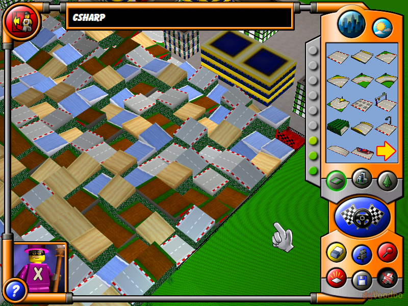
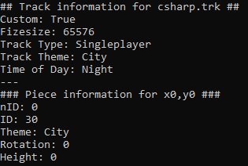

# srtools
Utilities for LEGO Stunt Rally (LSR).

### Note: The code in this repository is very awful and has been archived, as it is very awful and has been superceded by [LSRutil.NET](https://github.com/YellowberryHN/LSRutil.NET). 

## Utilities

## Python 3

### gentrack.py

A tool to generate a LSR .trk file. Should only be considered a proof-of-concept.

### readtrack.py

Outputs various details about the track file.

### lsrutil.py

Contains helper data for the other scripts.

## C# #

### gentrack.cs

gentrack.py rewritten in C#, should behave the same way.

### readtrack.cs

readtrack.py rewritten in C#, should behave the same way.

## Credits

- Zsolt '[YellowberryHN](https://github.com/YellowberryHN)' Zitting - gentrack, readtrack, file format research
- Alberto '[kbios](https://github.com/kbios)' Mattea - file format research
