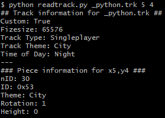

# srtools
Utilities for LEGO Stunt Rally (LSR).
Requires Python 3.

## Utilities

### gentrack.py

A tool to generate a LSR .trk file. Should only be considered a proof-of-concept.

### readtrack.py

Outputs various details about the track file.

### lsrutil.py

Contains helper data for the other scripts.

## Credits

- Zsolt 'Yellowberry' Zitting - gentrack.py, file format research
- Alberto 'kbios' Mattea - file format research
